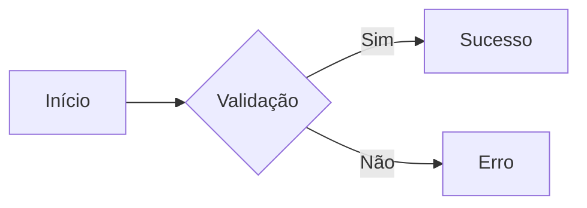

# 📄 Master Template: Documentos e Manuais
# ID: T-DOC-MASTER-01
# Versão: 1.0.0

## 🏷️ Propriedades do Template
*   **Sistema**: [A|B|C|D|E|F]
*   **Módulo**: [Nome do Módulo]
*   **Submódulo**: [Nome do Submódulo]
*   **Tipo**: Manual Operacional / DNA / Protocolo

---

## 🏛️ Estrutura Hierárquica (Visual Genius)

### 1. Contexto e Objetivo
Descreva o "Porquê" deste documento e qual problema ele resolve no ecossistema.

### 2. Regras de Negócio / Sockets LEGO
*   **Input**: O que entra de informação.
*   **Processo**: O que é feito (A inteligência).
*   **Output**: O que sai e para onde vai.

### 3. Procedimentos Operacionais (Passo-a-Passo)
1.  Ação inicial.
2.  Ação intermediária.
3.  Validação final.

### 4. Diagrama de Fluxo (Mermaid)

---

## 🎨 Estilo Visual Recomendo
*   **Headers**: Usar emojis no início para facilitar o scan visual.
*   **Alertas**: Usar blocos `> [!NOTE]` ou `> [!WARNING]` para pontos críticos.
*   **Links**: Sempre usar links relativos para outros documentos da biblioteca.
