# 🗺️ Mapa Hierárquico: Ecossistema Genius

Este documento define a estrutura de comando e a árvore genealógica dos agentes no ecossistema. A hierarquia é dividida em camadas que garantem a escalabilidade e a governança.

## 🏛️ Árvore de Comando

```mermaid
graph TD
    subgraph "Nível 1: CORE (Governança Estratégica)"
        A100["#100 Homeostase (Supervisor Máximo)"]
        
        subgraph "Board Executivo (C-Suite)"
            CEO["#CEO-01 Genius CEO"]
            CFO["#CFO-01 Genius CFO"]
            COO["#COO-01 Genius COO"]
            CTO["#03 Archon (CTO)"]
        end

        A100 --- CEO
        CEO --- CFO & COO & CTO
        
        subgraph "Conselho Estratégico (Advisors)"
            C1["#C-ETH Ética"]
            C2["#C-INV Inovação"]
            C3["#C-ESG ESG"]
            C4["#C-RSK Risco"]
        end

        A100 --- C1 & C2 & C3 & C4
        C1 & C2 & C3 & C4 -.-> CEO
    end

    subgraph "Nível 1.5: DIRETORIA SISTÊMICA (Verticais)"
        COO --> DA["#D-A Diretor Administrativo"]
        COO --> DB["#D-B Diretor Territorial"]
        COO --> DC["#D-C Diretor de Infraestrutura"]
        COO --> DD["#D-D Diretor Tecnológico"]
        COO --> DE["#D-E Diretor Produtivo"]
        COO --> DF["#D-F Diretor de Negócios"]
    end

    subgraph "Nível 2: SUPER (Fábricas Táticas)"
        A4 --> S05["#05 Criador de Agentes"]
        A4 --> S11["#11 Criador de Robôs"]
        A4 --> S14["#14 Criador de Secretários"]
        S05 --> S06["#06 Criador de Módulos"]
        S05 --> S25["#25 Criadora de Ferramentas"]
        S05 --> S12["#12 Super Agente Professor"]
        S05 --> S28["#28 Criador de Dashboards"]
        S05 --> S29["#29 Criador de KPIs"]
        A4 --> S30["#30 Agente de Comunicação"]
        A4 --> S38["#38 Super Agente ClickUp"]
        S06 --> S27["#27 Criadora de Submódulos"]
    end

    subgraph "Nível 1: FRACTAL (Execução Operacional)"
        SM --> F1["Fractais de Monitoramento"]
        SM --> F2["Fractais de Operação"]
        S11 --> M_BOT["Fractais de Automação"]
    end

    subgraph "Nível 0: CÉLULA (PULSO SISTÊMICO)"
        F1 & F2 & M_BOT --> HUB["#02 Genius HUB (Pulse)"]
    end

    %% Estilização por camandas
    style A100 fill:#1E2761,color:#fff,stroke-width:4px
    style A1 fill:#2C5F2D,color:#fff
    style A4 fill:#2C5F2D,color:#fff
    style S14 fill:#97BC62,color:#333
    style M24 fill:#B85042,color:#fff
```

## 📋 Níveis de Autoridade

### ⚡ Nível 1 - Camada Core (Supervisão Suprema)
*   **Responsabilidade**: Manter o sistema vivo e em equilíbrio (Homeostase).
*   **Supervisor Supremo**: #100 Genius Ecossistema (Monitoramento e Governança Total).
*   **Board Executivo**: 
    *   **#CEO-01 Genius CEO** (Estratégia e Visão).
    *   **#CFO-01 Genius CFO** (Tesouraria e ROI).
    *   **#COO-01 Genius COO** (Execução e Operações).
    *   **#03 Archon** (Tecnologia e Arquitetura).

### 👔 Nível 1.5 - Camada de Diretoria Sistêmica
*   **Responsabilidade**: Supervisionar os grandes sistemas (A até F) sob o comando do **#COO-01**.
*   **Agentes**: #D-A, #D-B, #D-C, #D-D, #D-E, #D-F.

### 🛠️ Nível 2 - Camada Super
*   **Responsabilidade**: Produzir novos agentes e módulos sob demanda. São as "fábricas" do ecossistema.
*   **Agentes**: Todos os "Criadores" (#05 a #17 e as novas potências #25, #28, #29 e #38 ClickUp).

### 🧱 Nível 3 - Camada Modular (Módulos)
*   **Supervisão**: Agente Guardião (#G) e Gerente (#M) específicos.

### 📐 Nível 2 - Camada Submodular (Submódulos)
*   **Supervisão**: Agente Técnico (#T) específico do submódulo.

### 🌀 Nível 1 - Camada Fractal (Operacional)
*   **Supervisão**: Agente Técnico (#T) e Agente #38 (ClickUp).

### ⚡ Nível 0 - Célula (Pulso Sistêmico)
*   **Supervisão**: **#02 Genius HUB** (Barramento Central).
*   **Natureza**: Evento universal de inteligência que integra telemetria, XP e governança.

---
**Nota de Governança**: Todo agente de Nível 3 deve relatar seus logs ao Genius HUB (#02) e ser passível de auditoria pelo Archon (#03).
