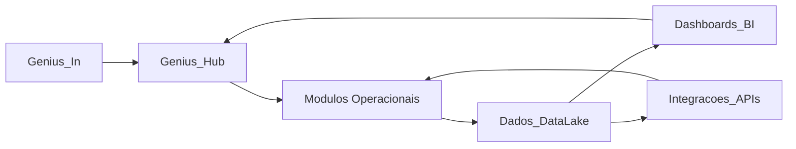
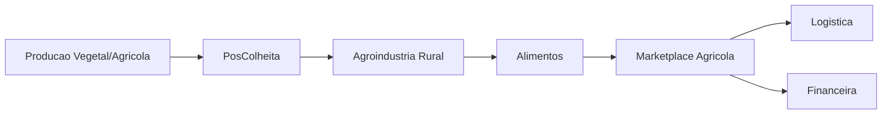
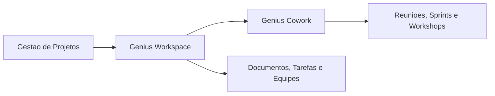
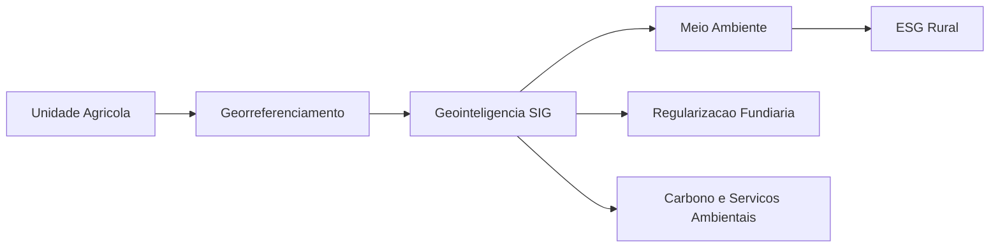
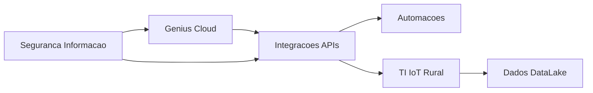
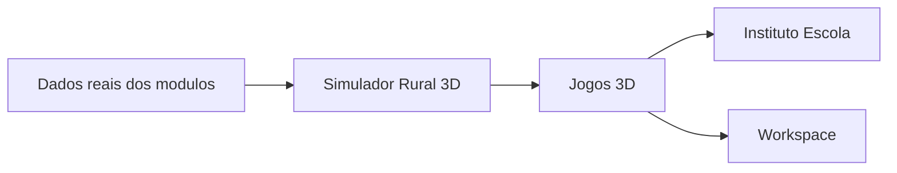

# Fluxos Principais do Ecossistema Genius

Este documento descreve os fluxos macro que conectam as plataformas, modulos e sistemas core do ecossistema Genius.

## 1. Fluxo Core De Entrada, Orquestracao E Dados

Resumo:
Genius_In recebe, Hub coordena, modulos executam, DataLake armazena, BI interpreta e Hub devolve visao integrada.

## 2. Fluxo Agroproducao Para Mercado

Resumo:
A producao gera produto rastreavel, a pos-colheita classifica, a agroindustria transforma, alimentos valida e marketplace vende.

## 3. Fluxo Projetos, Workspace E Cowork

Resumo:
Projetos define entregas formais, Workspace organiza a execucao digital e Cowork oferece suporte presencial.

## 4. Fluxo Geoambiental

Resumo:
A unidade agricola fornece a base, georreferenciamento estrutura localizacao, SIG integra camadas e os modulos ambientais executam seus processos.

## 5. Fluxo TechOps

Resumo:
Cloud sustenta, APIs conectam, Automacoes executam rotinas, IoT gera dados e Seguranca protege tudo.

## 6. Fluxo 3D Experience

Resumo:
O simulador cria cenarios tecnicos; Jogos 3D transforma cenarios em aprendizagem, treinamento e engajamento.