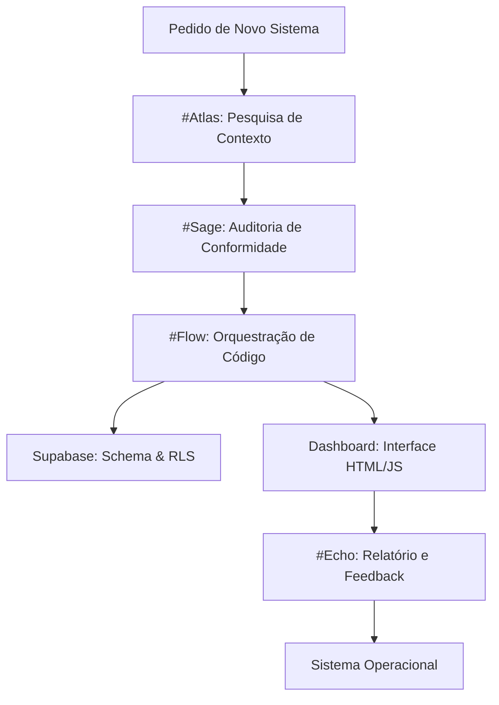

# Pipeline: Criação de Sistemas (A Esteira de Produção)

Este documento define a "Esteira de Produção" (o fluxo agentico) que executa a criação de sistemas no Ecossistema Genius através do framework **Harness**.

## Arquitetura do Pipeline

## Etapas de Execução

### Fase 1: Inteligência Contextual (#Atlas)
- **Função:** Scannear o Obsidian em busca de padrões pré-existentes.
- **Output:** Documento de contexto com referências e restrições.

### Fase 2: Validação de Qualidade (#Sage)
- **Função:** Aplicar os Guardrails de qualidade sobre o PRD gerado.
- **Crivo:** Rejeitar qualquer arquitetura que não seja modular ou segura (RLS).

### Fase 3: Construção Industrial (#Flow)
- **Função:** Atuar como o "Mestre de Obras".
- **Ações:** 
    - Gerar SQL para o Supabase.
    - Atualizar a navegação do `index.html`.
    - Registrar novos agentes se necessário.

### Fase 4: Entrega e Notificação (#Echo)
- **Função:** Consolidar os logs de criação e notificar o usuário.
- **Canais:** Console do Dashboard e Proxy Telegram (#30).

---
*Manual de Operações Harness - Orquestração Autônoma Genius.*
