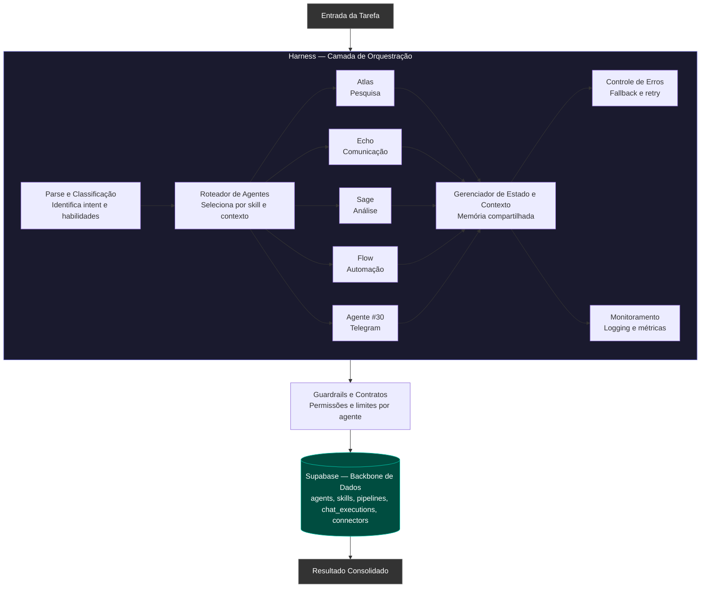

# Arquitetura Harness — Ecossistema Genius

Este documento descreve o fluxo de orquestração e a estrutura lógica do sistema Harness, conforme definido no diagrama de design do sistema.

## Visão Geral do Fluxo

## Componentes Críticos

### 1. Harness (Orquestração)
É o ambiente de execução onde a inteligência é processada. 
- **Roteamento Dinâmico:** A capacidade de escolher agentes específicos baseados na necessidade da tarefa.
- **Memória Compartilhada:** Fundamental para que o Agente #30 (Telegram) saiba o que o Sage (Análise) concluiu, por exemplo.

### 2. Guardrails e Contratos
Esta camada atua como o sistema de segurança, garantindo que nenhum agente exceda seus limites de API ou permissões de dados antes de gravar no Supabase.

### 3. Supabase Backbone
A estrutura de dados centralizada que sustenta o ecossistema:
- `agents`: Definições e identidades.
- `skills`: Capacidades técnicas.
- `pipelines`: Fluxos de trabalho pré-definidos.
- `chat_executions`: Histórico de interações.
- `connectors`: Integrações externas.

---
*Documento gerado para preservação da arquitetura sistêmica do Genius.*
